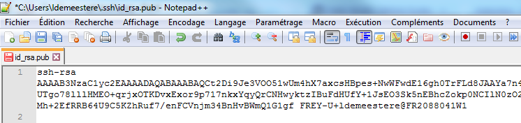
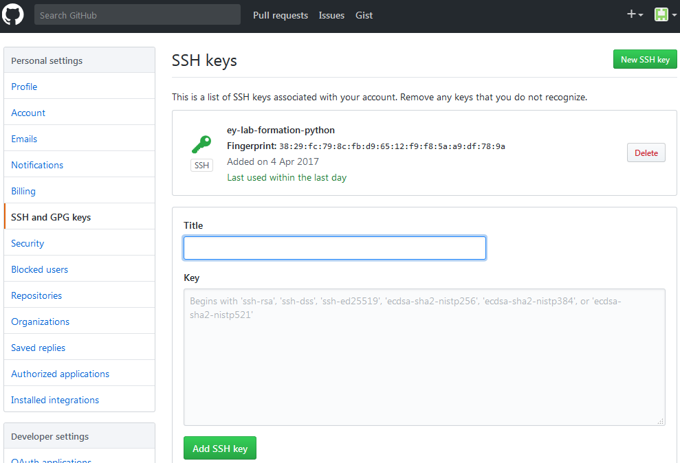
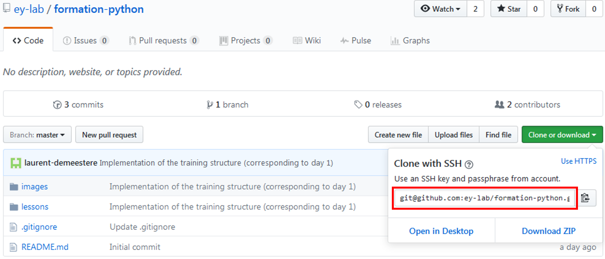
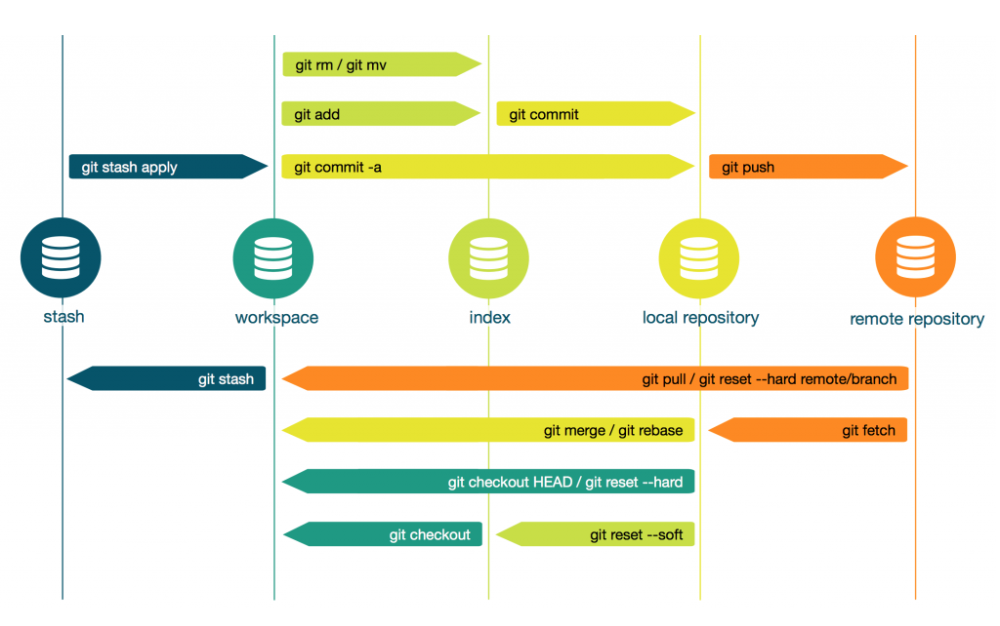

# Git

## What is Git ?

By far, Git is the most widely used modern version control system in the world today. Git is a mature, actively maintained open source project originally developed in 2005 by Linus Torvalds, the famous creator of the Linux operating system kernel.

Git is, first and foremost, a Version Control System (VCS). There are many version control systems out there : CVS, SVN, Mercurial, Fossil, and, of course, Git.

## Download Git for Windows

The first thing to do is to [download Git for Windows](https://git-for-windows.github.io/) in order to be able to use Git Bash in your Windows environment.

## Configure Git to use a proxy

Before using Git, some proxy parameters have to be changed to make running Git to EY.

#### What is a proxy ?

A proxy or proxy server is basically another computer that acts as a gateway between a local network and a larger-scale network such as the Internet. By connecting through one of these servers, your computer sends your requests to the proxy server which then processes your request and returns what you were wanting.


Proxies are used for a number of reasons such as to filter web content, to go around restrictions such as parental blocks, to screen downloads and uploads and to provide anonymity when surfing the internet.

#### Proxy environment variables
Open a Git Bash terminal :


Set the proxy environment variables :
```bash
setx HTTP_PROXY "http://empweb2.ey.net:8080"
setx HTTPS_PROXY "https://empweb2.ey.net:8443"
setx ALL_PROXY "https://empweb2.ey.net:8443"
```
#### Set up Git proxy configuration
Configure a global proxy if all access to all repos require this proxy :
```bash
git config --global http.proxy http://empweb2.ey.net:8080
git config --global https.proxy https://empweb2.ey.net:8443
```
#### Reset Git proxy to default configuration
Unset global proxy configuration :
```bash
git config --global --unset http.proxy
git config --global --unset https.proxy
```

#### Reset proxy environment variables
Delete proxy environment variables :
```bash
export HTTP_PROXY=
export HTTPS_PROXY=
export ALL_PROXY=
```


## Get data from a remote repository with Git

#### What is GitHub?
GitHub is a code hosting platform for version control and collaboration. It lets you and others work together on projects from anywhere. GitHub offers both plans for private and free repositories on the same account which are commonly used to host open-source software projects.

To complete this training course, you need a [GitHub.com account](https://github.com/).

Among the alternatives at Github, we can mention :
- **Bitbucket**
You can connect up to five users to the platform for free. As part of the Atlassian software family, Bitbucket lets you integrate your other Atlassian products like Jira, Bamboo, and HipChat.

- **GitLab**
GitLab is a web-based Git repository manager with wiki and issue tracking features, using an open source license, developed by GitLab Inc. GitLab’s continuous integration (CI) capabilities also automate the testing and delivery of your code.

#### Git configuration

Regardless of which network protocol you use with Github, you need to identify yourself to Git first. You can identify yourself by using the two following Git commands :
```bash
git config --global user.name "YOUR NAME"
git config --global user.email "YOUR EMAIL ADDRESS"
```
The email address should be the same used to create your Github account.

#### Retrieving data : ssh or https ?
When you clone, push and pull changes between Github repositories and your computer there are two network protocols to choose from, ssh and https. But which one should you use and why does it matter?
- **https**
  - recommended by Github because its a port that is open in all network firewalls, therefore Github is universally accessible when using HTTPS
  - with HTTPS you are using the same username and password for your account, so if those details are seen or copied by someone, then that person has access to your entire account
- **ssh**
  - with SSH you create a public/private key pair for each computer you are going to use to connect to Github, you copy the public key to your Github account and when you push a change to Github it is signed with your private key so Github knows that its you that is pushing it
  - ssh keys are more secure because they do not provide access to your Github account (if your key is stolen you can still access your Github account and update your Github profile to delete any lost or stolen keys)

#### Set up an ssh public key
1. Run the ssh-keygen procedure :
```bash
ssh-keygen -t rsa
```
2. Your public key has been saved in */c/Users/*your_user_name*/.ssh/id_rsa.pub*

 

3. Copy public key from specified file and go to your GitHub profile => Settings => SSH and GPG keys => New SSH key => Paste your SSH key there => Save

 

#### Cloning Git repository locally

Now that you have created your ssh key and manage the necessary Git configurations, you could retrieve the Git repository corresponding to this Python training which is located at [https://github.com/ey-lab/formation-python](https://github.com/ey-lab/formation-python). Near the top of the screen, you will see the following Github's repo URL :



Copy this address to your clipboard and return to your Git Bash terminal. By default, the command `git clone repository_name` will clone the remote repository in your current workspace. If you want to clone the repository somewhere else, simply add the pathname at the end of the command :
```bash
git clone git@github.com:ey-lab/formation-python.git /c/Users/ldemeestere/Desktop/formation-python
```


## Git commands and concepts

#### Git concepts

Here are the basic terms you should familiarize yourself with :

- **Repository / Repo** : This is the project's source code that resides on github.com's servers. You cannot modify the contents of this repository directly unless you were the one who created it in the first place.

- **Fork** : Forking a project will create a copy of the original repository that you can modify as you please. Forked projects will appear in your own github.com account.

- **Cloning** : this will clone an online repository to your hard drive so you may begin working on your modifications. This local copy is called your local repository.

- **Branch** : A branch is a different version of the same project. In the case of T2DMIT, you will see 2 branches : the master branch and the development branch.

- **Remote** : A remote is simply an alias pointing to an online repository. It is much easier to work with such aliases than typing in the complete URL of online repositories every single time.

- **Staging Area** : Whenever you want to update your online repository (the one appearing in your github.com account), you first need to add your changes to your staging area. Modifying files locally will not automatically update your staging area's contents.

#### Schema



#### Git commands

- **Fetch** : git fetch will download the current state (containing updated and newly created branches) of an online repository without modifying your local repository. It places its results in .git/FETCH_HEAD.

- **Merge** : git merge will merge the modifications of another branch into the current working branch.

- **Pull** : git pull is actually a combination of git fetch and git merge. It fetches the information from an online repository's branch and merges it with your local copy.

- **Add** : Whenever you modify a file in your local repository or create a new file, that file will appear as unstaged. Calling git add allows you to specify files to be added to your staging area.

- **Commit** : A commit records a snapshot of your staging area, making it ready to be pushed to an online repository.

- **Push** : git push will take all of your locally committed changes and upload them to a remote repository's branch.


# Exercise 1.1.1 : Clone a Git repository

1) Create your own GitHub account
2) Configure Git to deal with the EY proxy
3) Configure your name and e-mail address in Git
4) Setup your an SSH public key from your machine to the GitHub server
5) Clone the [Git repository corresponding to this training](https://github.com/ey-lab/formation-python)
