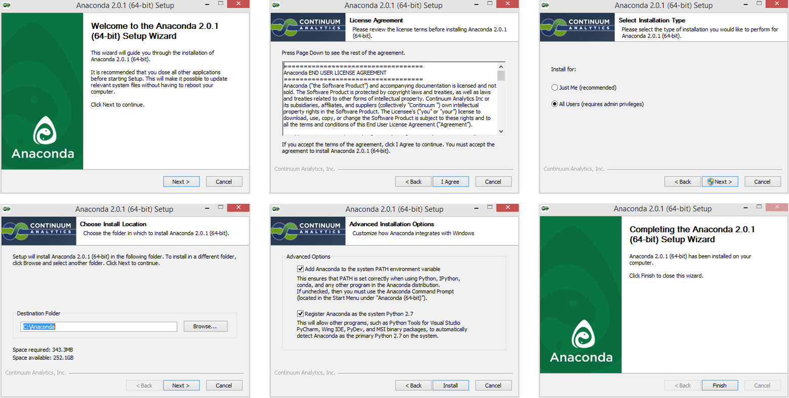
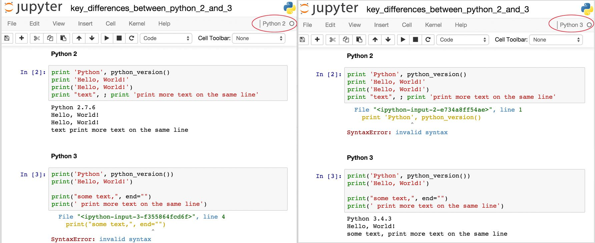
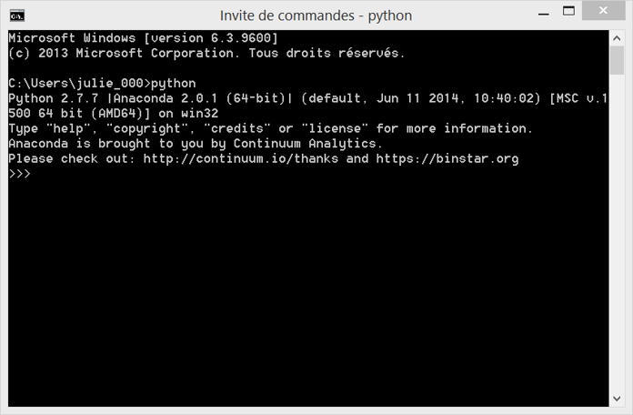
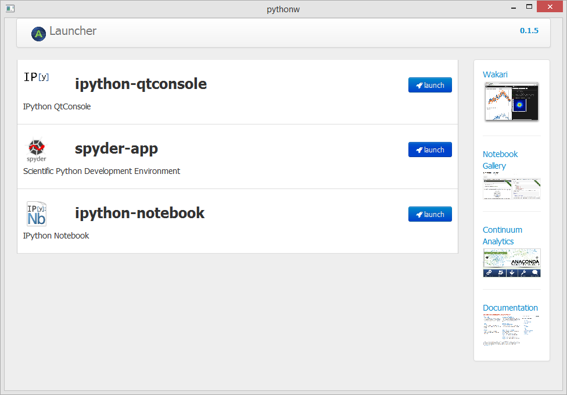
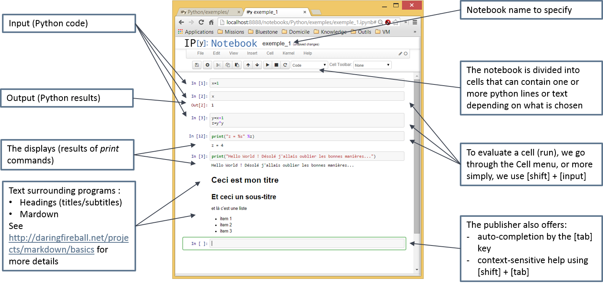
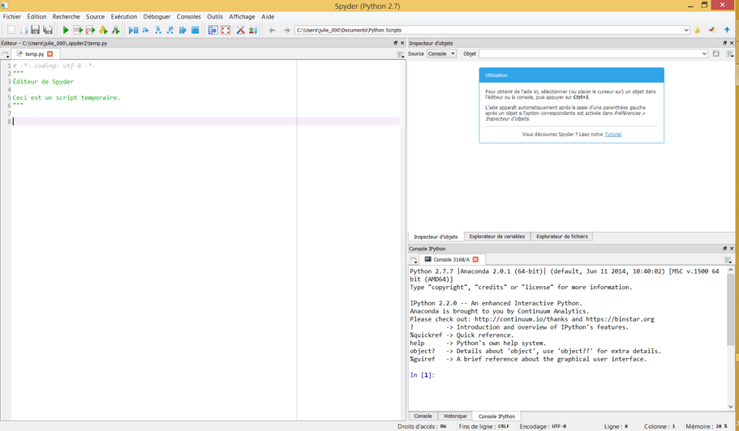

# Anaconda

Installing Python from Anaconda is very simple. Anaconda is available for Linux, macOS and Windows, and is Open Source.


## Installation of Anaconda on Windows

You can download Anaconda 4.3.1 from this link :

[https://www.continuum.io/downloads](https://www.continuum.io/downloads)

Following the successive steps :



## Python 2.7 or 3.0 ?

Many beginning Python users are wondering with which version of Python they should start.

Actually, there is currently no "right" or "wrong" as long as both Python 2.7.x and Python 3.x support the libraries that you are planning to use. However, there are some differences between those two most popular versions of Python.

For scientific work, version 2.7.x is currently the most adapted one (more modules and existing codes), and it is more mature and proven. Whereas Python 3.x represents the future, it is equipped with an improved language but it is still in development. That's why we recommend to adopt the 2.7.x Python version for the moment.

**Be careful** : the code that works with Python 2.7.x does not necessarily work with Python 3.x. You can see a simple example below.




## Launch Python from a shell

You can launch Python in the command prompt in Windows with the `python` (or `ipython`) command :




## Installation of a Python package

Anaconda 4.3.1 includes an easy installation of Python (2.7 or 3.6) and updates of over 100 pre-built and tested scientific and analytic Python packages. These packages include NumPy, Pandas, SciPy, Matplotlib, etc. Over 620 more packages are available. You can install any of them with just one command:

```bash
conda install package-name
```

Over [150 packages are automatically installed with Anaconda](https://docs.continuum.io/anaconda/pkg-docs).

You can try to install the package *pymongo* and test the following code `import pymongo`.


## Get started with IPython in the Jupyter Notebook

The Jupyter Notebook is an interactive environment for writing and running code.

#### Launch a notebook

You can start running a notebook server from different ways :
- with the command line using the `ipython notebook` or `jupyter notebook`command

- with the Anaconda prompt using the `ipython notebook` or `jupyter notebook`command
- with the launcher from Anaconda :

  

This will print some information about the notebook server in your console, and open a web browser to the URL of the web application (by default, http://127.0.0.1:8888).

Then you can start a new notebook :


#### Running code

The notebook consists of a sequence of cells. A cell is a multi-line text input field, and its contents can be executed by using `Shift-Enter`, or by clicking either the `Play` button the toolbar, or `Cell | Run` in the menu bar. The execution behavior of a cell is determined by the cell’s type.

There are four types of cells :
- code cells
- markdown cells
- raw cells
- heading cells

The structure of a Python notebook is as follows :



#### Managing the Kernel

The notebook is capable of running code in a wide range of languages, but each notebook is associated with a single Kernel (code is run in a separate process called the Kernel). This notebook is associated with the IPython kernel, therefore runs Python code. IPython supports Python 2.7 and 3.3 or newer.

The Kernel can be interrupted or restarted. It maintains the state of the notebook's computations. You can reset this state by restarting the Kernel. This is done by clicking on a button in the toolbar above.

## Spyder

Spyder is an open source cross-platform Integrated Development Environment (IDE) for Python, which is available with Anaconda.



Spyder is an acronym for **S**cientific **PY**thon **D**evelopment **E**nvi**R**onment. The editor is a multi-language editor with a function/class browser. It has support for code analysis (using pyflakes and pylint), code completion, horizontal and vertical splitting, etc.

You can choose to use IPython or Python consoles. It also integarates Matplotlib figures and contains a variable explorer (much like the ‘Environment’ in RStudio).


# Exercice 1.2.1 : Create your first Python Notebook

1) Create your first notebook in the directory "...\formation-python\2017-04-27-training"
2) Rename it "121-my-first-notebook-*yourfirstname*-*yourlastname*.ipynb"
3) Try to get this result :


4) Save it and push it (with Git)
5) See your result on [Github](https://github.com/ey-lab/formation-python)
