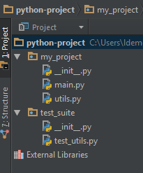
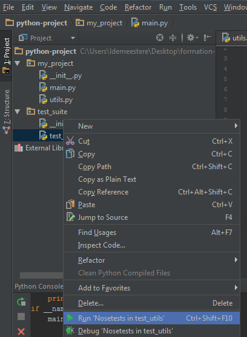
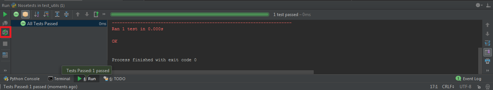

# Industrialization of a Python project

## Creating a package in Python

For a large number of Python classes or modules, it is often necessary to organize them into packages. Indeed, when the number of modules (a module might be just a file containing some classes) in any project grows significantly, it is wiser to organize them into packages, which actually means placing functionally similar modules/classes in the same directory.

#### Steps to Create a Python Package

Working with Python packages is really simple. All you need to do are these following steps :

- Create a directory and give it your package's name
- Put your modules inside (it can be several Python scripts)
- Create a `__init__.py` file in the directory

The `__init__.py` file is necessary because with this file, Python will know that this directory is a Python package directory and not an ordinary directory. This `__init__.py` file can stay empty.

## Exercise 4.2.1 : Create a Python Package

First, create a new directory named *python-project* in which you could do these different steps :

**1) Create a package directory :** create a directory named *my_project*

**2) Add modules :**

- a Python file named `utils.py` with the following code :

```python
def my_sum(x, y):
    return x + y
```

- a Python file named `main.py` with the following code :

```python
import my_project.utils as utils


def main(arg1, arg2):
    result = utils.my_sum(arg1, arg2)
    print 'The result is ' + str(result)

if __name__ == '__main__':
    main(1, 2)
```

**3) Test your package : ** you can test that your Python package is ok or not by running the *main.py* script (with Pycharm, the Python console or with a command line)

What is missing to make your code running ?

**4) Add the **`__init__.py`** file :** create an empty file named `__init__.py` inside

**5) Test again your package : ** you can test that your Python package is now ok by running the code from the question 3


## Unit tests with Python

Testing your code is very important, for you as for them who could work on your code. Here are some general rules about testing :

- A unit test should focus on one functionality and prove that it is correct

- Each unit test must be fully independent : each test must be loaded with a new dataset and may have to do some cleanup afterwards, which is usually handled by `setUp()` and `tearDown()` methods

- Try to make tests that run fast (if some tests are slow, they can be subject of another test suite which can be deployed separetly)

- Always run the full test suite before a coding session, and run it again after, this will give you more confidence that you did not break anything in the rest of the code

- The first step when you are debugging your code is to write a new test reproducing the bug

- Use long and descriptive names for testing functions (e.g. *test_square_negative_number()*), because these function names are displayed when a test fails, and should be as descriptive as possible

- These unit tests can be regarded as some code documentation because it tests different use cases according to an expected result, so they can largely help developers that has to work on the code of someone else

- Ideally one should take the habit of developing the tests even before developing the function to be tested


#### Unittest

`unittest` is the batteries-included test module in the Python standard library. Creating test cases is accomplished by subclassing `unittest.TestCase`.

Here is an example of a unit test :

```python
import unittest

def my_sum(x, y):
    return x + y

class MyTest(unittest.TestCase):
    def test_my_sum_for_negative_numbers(self):
        self.assertEqual(my_sum(-5, -1), -6)
```

The `unittest.TestCase` class provides several assert methods to check for and report failures. The following table lists the most commonly used methods :

| Method | Checks that |
|--------|--------|
| assertEqual(a, b) | a == b |
| assertNotEqual(a, b) | a != b |
| assertTrue(x) | bool(x) |
| assertFalse(x) | bool(x) |
| assertIs(a, b) | a is b |
| assertIsNot(a, b) | a is not b |
| assertIsNone(x) | x is None |
| assertIsNotNone(x) | x is not None |
| assertIn(a, b) | a in b |
| assertNotIn(a, b) | a not in b |
| assertIsInstance(a, b) | isinstance(a, b) |
| assertNotIsInstance(a, b) | not isinstance(a, b) |


## Exercice 4.2.2 : Creating and running a unit test

**1) Create a test directory :** in your *python-project* directory, create a directory named *test_suite*

**2) Add the **`__init__.py`** file :** create an empty file named `__init__.py` inside

**3) Create a file for testing your **`utils.py`** module : ** create a `test_utils.py` module in your test directory, in such a way as to obtain this :



**4) Run your test with Pycharm :** right-click on the `test_utils.py` file and run the tests :



*N.B. : Nosetests is an extension of unittest*

You should obtain this result :



*N.B. : Note that the 'Toggle auto-test' button allows to rerun the tests on code changes*

**6) Create a new test :

- Add a new module named `math.py` and insert this function inside :

#########################################
```python

```
#########################################

- Then test this function and run all tests in the same time


## setup.py file

## Python code documentation : doc strings


## Anaconda virtual environnements

#### Create a virtual environment

#### .PEX file


