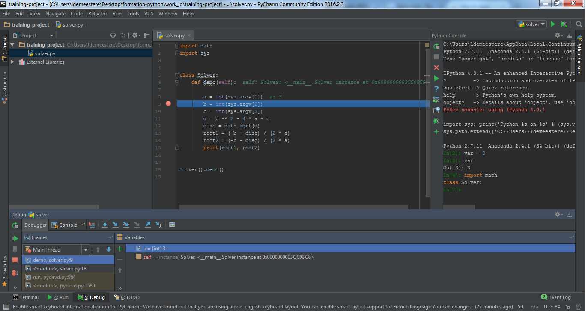
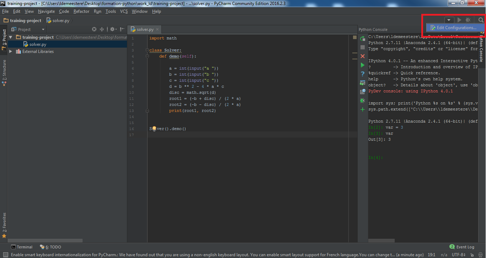

# Pycharm

## Download Pycharm

You can download the Pycharm Community Edition for Windowd from this link : https://www.jetbrains.com/pycharm/download/#section=windows


## Pycharm presentation

PyCharm is a cross-platform IDE that is primarily targeted for Python and web development. It is an editor and debugger developed by [JetBrains](https://www.jetbrains.com/), which is a software development company.

Pycharm has very interesting features :

- **Intelligent Code Editor** : take advantage of language-aware code completion, error detection, and on-the-fly code fixes.

- **Smart Code Navigation** : use smart search to jump to any class, file or symbol. It only takes one click to switch to the declaration, super method, test, usages, implementation, and more.

- **Fast and safe refactoring** : refactor your code the intelligent way, with safe "Rename" and "Delete", "Extract Method", "Introduce Variable", and other refactorings.

- **Debugging and testing** : use the powerful debugger. Create and run your tests with coding assistance and a GUI-based test runner.

- **VCS, Deployment and Remote Development** : save time with a unified UI for working with Git, SVN, Mercurial or other version control systems. Run and debug your application on remote machines.

- **Database tools** : access Oracle, SQL Server, PostgreSQL, MySQL and other databases right from the IDE. Rely on PyCharm’s help when editing SQL code, running queries, browsing data, and altering schemas.

- **Python Web frameworks** : PyCharm offers great framework-specific support for modern web development frameworks such as Django, Flask, Google App Engine, Pyramid, and web2py, including Django templates debugger, manage.py and appcfg.py tools, special autocompletion and navigation, just to name a few.

- **IPython Notebook integration and interactive Python console** : PyCharm integrates with IPython Notebook and delivers a solution that combines the advantages of IPython Notebook with extra benefits that the most intelligent Python IDE can offer, including autocompletion, navigation, error checking, etc.

- **Customizable UI** : Pycharm offers a fine-tuned workspace with customizable color schemes and key-bindings.

- **Etc.**

Here is screenshot of what Pycharm looks like :



But a demonstration is better than a long speech, so let's start Pycharm !


## Exercise 4.1 : Creating a Python project with Pycharm

Solving a simple quadratic equation : `a.x² + b.x + c = 0`.

**1) Creating and running your first Python project :**

- create a directory where you will store your project (e.g. )
- create a new project with Pycharm (*"File"* and then *"New Project..."*) by selecting this directory
- create a Python file named *solver.py*
- write the following block of code inside :

```python
import math
import sys


class Solver:
    def demo(self):

        a = int(sys.argv[1])
        b = int(sys.argv[2])
        c = int(sys.argv[3])
        d = b ** 2 - 4 * a * c
        disc = math.sqrt(d)
        root1 = (-b + disc) / (2 * a)
        root2 = (-b - disc) / (2 * a)
        print(root1, root2)


Solver().demo()
```

**2) Launching your application :**

- Launch your Python script from the *Edit configurations* panel with the following parameters : *a = 3*, *b = 5*, *c = -4*.



- What are the values of the 2 roots of this equation ?

**3) Debugging your first Python application :**

- From now, launch your Python script from the *Edit configurations* panel with the following parameters : *a = 3*, *b = 5*, <span style="color:red">*c = 6*<span>.

- Note that PyCharm is reporting a run-time error : *ValueError: math domain error*.

- By using the PyCharm debugger, see exactly what’s happening in your code. To start debugging, you will have to set some breakpoints (to create breakpoints, just click on the left gutter).

- Where did the problem came from ?

- Correct it with an *if/else* block to encapsulate this error and lauch your script again
